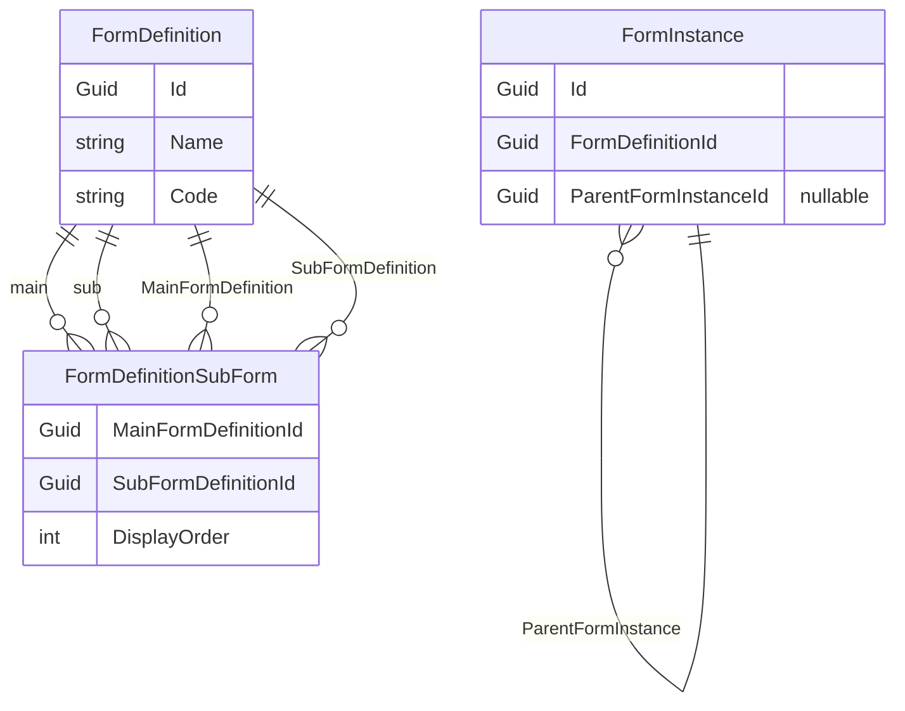

# Main Form / Sub Form (DHR) – Uygulama Planı

## Hedef

- Ana formun onaya gönderilebilmesi için, o ana forma bağlı tüm alt formların doldurulmuş ve en az **InReview** veya **Approved** olması zorunlu.
- **Bir alt form tanımı birden fazla farklı ana formun alt formu olabilir** (çoktan çoğa). Bu yüzden tanım seviyesinde junction tablo kullanılacak; `FormDefinition` üzerinde tek bir `ParentFormDefinitionId` olmayacak.
- Instance seviyesinde bir alt form instance'ı yine tek bir ana form instance'ına bağlı kalacak (`FormInstance.ParentFormInstanceId`).

---

## Mimari Özet

- **Tanım seviyesi:** `FormDefinitionSubForm` (MainFormDefinitionId, SubFormDefinitionId) ile çoktan çoğa. "X formunun alt formları" = junction'da MainFormDefinitionId = X olan satırlardaki SubFormDefinitionId'ler.
- **Instance seviyesi:** `FormInstance.ParentFormInstanceId` ile alt form instance'ı tek bir ana form instance'ına bağlı.

---

## 1. Domain ve veritabanı

### 1.1 Yeni entity: FormDefinitionSubForm

- **Dosya:** [Backend/src/Domain/Entities/FormDefinitionSubForm.cs](Backend/src/Domain/Entities/FormDefinitionSubForm.cs) (yeni).
- Alanlar: `MainFormDefinitionId` (Guid), `SubFormDefinitionId` (Guid), isteğe bağlı `DisplayOrder` (int). Navigation: `MainFormDefinition`, `SubFormDefinition`.
- Unique kısıt: (MainFormDefinitionId, SubFormDefinitionId) çifti tekrarlanmasın.

### 1.2 FormDefinition

- **Dosya:** [Backend/src/Domain/Entities/FormDefinition.cs](Backend/src/Domain/Entities/FormDefinition.cs).
- **ParentFormDefinitionId eklenmeyecek.**
- Yeni navigation: `MainFormSubFormRelations` (ICollection&lt;FormDefinitionSubForm&gt;) — bu formun **ana form** olduğu ilişkiler. Alt form listesi bu ilişkiden türetilecek.

### 1.3 FormInstance

- **Dosya:** [Backend/src/Domain/Entities/FormInstance.cs](Backend/src/Domain/Entities/FormInstance.cs).
- Eklenen alan: `ParentFormInstanceId` (Guid?, nullable).
- Navigation: `ParentFormInstance` (FormInstance?), `SubFormInstances` (ICollection&lt;FormInstance&gt;).

### 1.4 EF Core ve migration

- **Config:** [Backend/src/Infrastructure/Persistence/Configurations/](Backend/src/Infrastructure/Persistence/Configurations/) altında `FormDefinitionSubFormConfiguration.cs` (yeni); mevcut `FormDefinitionConfiguration.cs` ve `FormInstanceConfiguration.cs` güncelle (ilişkiler ve FK).
- **DbContext:** FormDefinitionSubForm için DbSet ekle; gerekirse Fluent API.
- **Migration:** (1) `FormDefinitionSubForms` tablosu (MainFormDefinitionId, SubFormDefinitionId, DisplayOrder, FK'lar, unique index). (2) `FormInstances` tablosuna `ParentFormInstanceId` (nullable uuid), FK ve indeks.

---

## 2. Repository ve sorgular

### 2.1 GetSubFormDefinitionsAsync (junction üzerinden)

- **Dosya:** [Backend/src/Infrastructure/Repositories/FormInstanceRepository.cs](Backend/src/Infrastructure/Repositories/FormInstanceRepository.cs) (satır 196–202).
- Mevcut implementasyon `FormDefinition.ParentFormDefinitionId` kullanıyor; bu kaldırılacak. Yeni mantık: `FormDefinitionSubForms` tablosunda `MainFormDefinitionId == formDefinitionId` olan satırlardan `SubFormDefinitionId` listesini al; bu Id'lerle FormDefinition'ları çek (Include gerekmez, sadece liste dön). Veya junction + SubFormDefinition Include ile tek sorguda çözülebilir.

### 2.2 FormDefinitionRepository GetById

- **Dosya:** [Backend/src/Infrastructure/Repositories/FormDefinitionRepository.cs](Backend/src/Infrastructure/Repositories/FormDefinitionRepository.cs) (satır 19–25).
- `Include(fd => fd.SubFormDefinitions)` kaldırılacak (artık yok). Yerine `Include(fd => fd.MainFormSubFormRelations).ThenInclude(r => r.SubFormDefinition)` eklenecek ki DTO'da SubFormDefinitions dolu gelsin.

### 2.3 FormInstanceRepository GetById

- **Dosya:** [Backend/src/Infrastructure/Repositories/FormInstanceRepository.cs](Backend/src/Infrastructure/Repositories/FormInstanceRepository.cs) (satır 19–35).
- `ThenInclude(fd => fd.SubFormDefinitions)` → FormDefinition'da artık SubFormDefinitions yok; alt form listesi junction'dan gelecek. FormDefinition yüklendiğinde `MainFormSubFormRelations` ve `SubFormDefinition` Include edilebilir; ya da GetSubFormDefinitionsAsync zaten ayrı çağrılıyor. GetById'de FormDefinition'ın "alt formları" için: `Include(f => f.FormDefinition).ThenInclude(fd => fd.MainFormSubFormRelations).ThenInclude(r => r.SubFormDefinition)` kullanılabilir ki mapping'de SubFormDefinitions dolu olsun.

---

## 3. DTO ve mapping

### 3.1 FormDefinitionDto

- **Dosya:** [Backend/src/Application/DTOs/FormDefinitionDto.cs](Backend/src/Application/DTOs/FormDefinitionDto.cs). `SubFormDefinitions` (List&lt;FormDefinitionDto&gt;) zaten var. `ParentFormDefinitionId` varsa kaldırılabilir veya kullanılmadan bırakılır (revize planda kullanılmıyor).

### 3.2 MappingProfile

- **Dosya:** [Backend/src/Application/Common/Mappings/MappingProfile.cs](Backend/src/Application/Common/Mappings/MappingProfile.cs).
- FormDefinition → FormDefinitionDto: `SubFormDefinitions` artık `src.MainFormSubFormRelations.Select(r => r.SubFormDefinition)` ile map edilecek (Include ile MainFormSubFormRelations ve SubFormDefinition yüklü olmalı).

---

## 4. Backend – Ana form gönderiminde alt form kontrolü

### 4.1 SubmitCompleteForm

- **Dosya:** [Backend/src/Application/Commands/Forms/SubmitCompleteForm.cs](Backend/src/Application/Commands/Forms/SubmitCompleteForm.cs).
- **Yer:** Status'u InReview yapmadan ve kaydetmeden önce (yaklaşık satır 248 civarı, `isSendToWorkflow` true iken).
- **Mantık:** (UpdateFormInstance ile aynı) Bu form instance'ının FormDefinitionId'si için `GetSubFormDefinitionsAsync` çağır. Dönen liste boş değilse bu form instance Id için `GetSubFormInstancesAsync` çağır. Her alt form tanımı için, ilgili ana instance'a bağlı ve durumu InReview veya Approved olan en az bir instance var mı kontrol et; yoksa `InvalidOperationException` at: "Ana form gönderilemez. Aşağıdaki alt formlar tamamlanmadan ana form gönderilemez: {isimler}."
- Sadece **gönderim** (isSendToWorkflow true) durumunda çalışsın; taslak kaydetmede çalışmasın.

---

## 5. Form tanımı – Alt form ataması API

### 5.1 Yeni endpoint ve command

- **Endpoint:** `PUT /api/FormDefinitions/{id}/subforms` (veya benzeri route). Body: `{ "subFormDefinitionIds": ["guid", ...] }`.
- **Command:** Örn. `SetFormDefinitionSubFormsCommand` (Id, SubFormDefinitionIds). Handler: (1) Mevcut junction kayıtlarını bu main form id ile getir. (2) Gönderilen liste ile karşılaştır; eklenecek Id'ler için yeni FormDefinitionSubForm ekle, çıkarılacaklar için sil. (3) Aynı form birden fazla ana formda alt form olabildiği için sadece bu ana forma ait junction satırları güncellenir.
- **Dosyalar:** Yeni command/handler; [Backend/src/Web/Endpoints/FormDefinitions.cs](Backend/src/Web/Endpoints/FormDefinitions.cs) içinde MapPut ile bağlama.

### 5.2 Form definition GetById

- GetById zaten repository üzerinden FormDefinition döndürüyor. Repository'de MainFormSubFormRelations + SubFormDefinition Include edildiği ve mapping SubFormDefinitions'ı doldurduğu sürece mevcut GetById değişmeden alt form listesini dönebilir.

---

## 6. Frontend – Form tanımı düzenleme

- **Dosya:** [Frontend/src/app/(firm-admin)/form-definitions/[id]/page.tsx](Frontend/src/app/(firm-admin)/form-definitions/[id]/page.tsx).
- "Alt formlar" bölümü ekle: Aynı tenant’a ait diğer form tanımlarından çoklu seçim (multi-select veya checkbox listesi). Bu formun Id’si ana form; seçilen formlar alt form olarak atanacak.
- Kaydetme: Form tanımı kendisi (ad, schema vb.) mevcut Update ile kaydedilir; alt form listesi ayrı bir çağrı ile `PUT .../subforms` ile gönderilir (sayfa kaydedilirken veya "Alt formları kaydet" butonu ile). API route: Frontend’de [Frontend/src/app/api/](Frontend/src/app/api/) altında form-definitions ile uyumlu bir proxy veya doğrudan backend endpoint’ine istek.

---

## 7. Frontend – Fill sayfası hata gösterimi

- **Dosya:** [Frontend/src/app/(forms)/forms/[id]/fill/page.tsx](Frontend/src/app/(forms)/forms/[id]/fill/page.tsx).
- Ana form "Gönder" ile SubmitComplete veya Update çağrıldığında backend’den dönen hata (özellikle "Ana form gönderilemez. Aşağıdaki alt formlar…") kullanıcıya gösterilecek: toast veya form üstünde inline mesaj. Mevcut client-side uyarıya ek olarak backend cevabı da işlensin.

---

## 8. Bağımlılıklar ve sıra

- Entity ve migration tamamlanmadan repository/mapping değişiklikleri derlenmez. Sıra önerisi: (1) Domain entity’ler + FormDefinitionSubForm, (2) EF config + migration, (3) Repository ve GetSubFormDefinitionsAsync revizyonu, (4) Mapping, (5) SubmitCompleteForm validasyonu, (6) Subforms API ve command, (7) Frontend form tanımı alt form alanı, (8) Frontend fill hata gösterimi.

---

## Özet tablo

| Konu                       | Uygulama                                                                                                |
| -------------------------- | ------------------------------------------------------------------------------------------------------- |
| FormDefinition             | ParentFormDefinitionId yok. MainFormSubFormRelations (junction collection) eklenecek.                   |
| Ana–alt (tanım)            | FormDefinitionSubForm junction tablosu; bir alt form birden fazla ana formun alt formu olabilir.        |
| FormInstance               | ParentFormInstanceId + SubFormInstances / ParentFormInstance eklenecek.                                 |
| GetSubFormDefinitionsAsync | Junction tablodan MainFormDefinitionId ile alt form tanımlarını döndürecek.                             |
| SubmitCompleteForm         | Ana form gönderilirken (isSendToWorkflow) alt form tamamlanma kontrolü eklenecek.                       |
| Alt form ataması           | PUT form-definitions/{id}/subforms ile junction güncellenecek; form tanımı sayfasında "Alt formlar" UI. |

