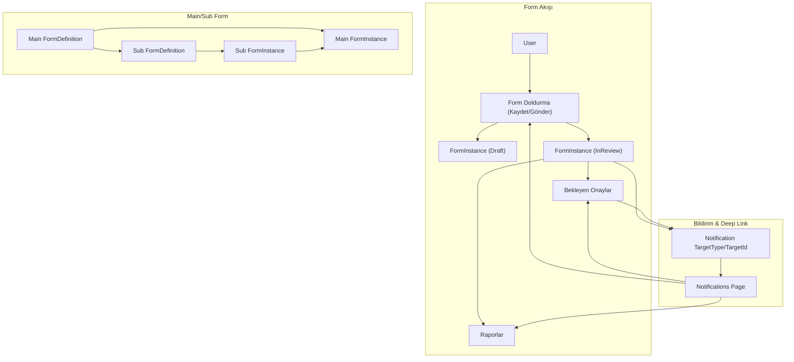

# MovithForms Özellik Geliştirme Planı

### 1. Mevcut Durumu Doğrulama ve Altyapı Keşfi

- **Backend inceleme**
  - `[Backend/src/Domain/Entities/FormDefinition.cs](Backend/src/Domain/Entities/FormDefinition.cs)` ve `[Backend/src/Domain/Entities/FormInstance.cs](Backend/src/Domain/Entities/FormInstance.cs)` ile form tanımı / instance yapısını netleştir.
  - `[Backend/src/Domain/Enums/FormStatus.cs](Backend/src/Domain/Enums/FormStatus.cs)` ile taslak/gönderilmiş statülerin mevcut kullanımını doğrula.
  - `[Backend/src/Domain/Entities/Notification.cs](Backend/src/Domain/Entities/Notification.cs)` ve `[Backend/src/Web/Endpoints/Notifications.cs](Backend/src/Web/Endpoints/Notifications.cs)` ile bildirim model ve API’lerini gözden geçir.
  - `[Backend/src/Web/Endpoints/Forms.cs](Backend/src/Web/Endpoints/Forms.cs)` ve varsa ilgili query/command handler’larını inceleyerek listeleme, onay, raporlama uçlarını tespit et.
- **Frontend inceleme**
  - `[Frontend/src/app/(firm-admin)/form-definitions/new/page.tsx](Frontend/src/app/\\\\(firm-admin)/form-definitions/new/page.tsx)` ve `[Frontend/src/app/(firm-admin)/form-definitions/[id]/page.tsx](Frontend/src/app/(firm-admin)/form-definitions/%5Bid%5D/page.tsx)` ile form builder’ın alan listesi ve schema kaydetme mantığını incele.
  - `[Frontend/src/app/(forms)/forms/[id]/fill/page.tsx](Frontend/src/app/(forms)/forms/%5Bid%5D/fill/page.tsx)` ile dinamik form render, submit ve (varsa) taslak kaydetme akışını netleştir.
  - `[Frontend/src/app/(forms)/my-forms/page.tsx](Frontend/src/app/\\\\(forms)/my-forms/page.tsx)`, `[Frontend/src/app/(operations)/pending-approvals/page.tsx](Frontend/src/app/\\\\(operations)/pending-approvals/page.tsx)` ve `[Frontend/src/app/(operations)/reporting/page.tsx](Frontend/src/app/\\\\(operations)/reporting/page.tsx)` ile Formlarım, Bekleyen Onaylar ve Rapor sayfalarının mevcut filtreleme ve detay gösterimlerini tespit et.
  - `[Frontend/src/app/(operations)/notifications/page.tsx](Frontend/src/app/\\\\(operations)/notifications/page.tsx)` ve `[Frontend/src/components/notifications/NotificationBell.tsx](Frontend/src/components/notifications/NotificationBell.tsx)` ile bildirim listeleme ve tıklama davranışlarını gözden geçir.

---

### 2. Form Tasarım Düzenleme Ekranında Form Alanlarının Sıralanması

**Hedef:** Form builder’da form alanlarını drag&drop veya benzeri bir mekanizma ile sıralayabilmek ve bu sırayı form doldurma ekranında kullanmak.

- **Backend tasarım**
  - Eğer sadece `SchemaJson` kullanılıyorsa, ayrı bir `Order` alanı eklemek yerine `SchemaJson.fields` dizisinin sırasını authoritative kabul et.
  - Gerekirse Application katmanında form tanımı için bir DTO tanımla (`FormSchema`, `FormFieldSchema`) ve burada `order` alanı opsiyonel tut.
- **Frontend implementasyonu (Form Builder)**
  - `new` ve `[id]` form-definitions sayfalarında alan listesini bir drag&drop kütüphanesi veya basit yukarı/aşağı butonları ile yeniden sıralanabilir hale getir.
  - Sıra değişikliğini local state içinde `fields` dizisinin yeniden sıralanması olarak uygula; kaydettiğinde `SchemaJson.fields` aynı sırayla backend’e gönderilsin.
  - Form builder UI’sında alanların sıra numarasını göster (örn. sol tarafta `1., 2., 3.`).
- **Form doldurma tarafı**
  - `fill/page.tsx` içinde `SchemaJson.fields` zaten bir dizi olarak kullanılıyorsa, ek sort yapmaya gerek yok; sadece dizideki sıraya göre render edildiğini doğrula.

---

### 3. Form Gönder / Kaydet Akışı (Taslak Mantığı) ve Gönderim Onayı

**Hedef:** Form doldurma ekranında "Kaydet" (taslak) ve "Gönder" (onaya gönder) butonları olması; gönderim öncesi kullanıcıdan "Emin misiniz?" onayı alınması.

- **Backend tarafı**
  - `FormStatus` enum’unu ve mevcut kullanımını inceleyerek `Draft` durumunun doğru kullanıldığını doğrula.
  - `[Backend/src/Web/Endpoints/Forms.cs](Backend/src/Web/Endpoints/Forms.cs)` içinde;
    - Taslak kaydetme için kullanılan endpoint’i (örn. `Update` veya `SaveDraft`) netleştir, gerekirse `SaveDraft` semantics’ini belirginleştir (status = Draft, workflow tetiklenmez).
    - Gönderme (submit) endpoint’ini belirle ve `Draft` → `InReview` (veya uygun status) geçişinin doğru yapıldığından emin ol.
    - Zorunlu alan validasyonlarının sadece Gönder işleminde tam sıkılıkta çalıştığını, taslakta daha esnek olduğunu gözden geçir.
- **Frontend tarafı (Form doldurma sayfası)**
  - `fill/page.tsx`’te submit handler’ı ikiye ayır:
    - "Kaydet" butonu: Var olan taslak kaydetme endpoint’ini çağıracak şekilde, daha gevşek validasyonla.
    - "Gönder" butonu: Tam validasyon + form status’ü `Draft`’tan `InReview`’e geçiren submit endpoint’ine istek.
  - "Gönder" için bir confirm modal ekle (örn. `Are you sure?` / `Bu formu onaya göndermek istediğinize emin misiniz?`).
  - Taslak kaydedildiğinde kullanıcıya toast / bildirim göster ve sayfadan çıkmadan çalışmasını sağla.
  - Gönderim sonrası kullanıcıyı uygun ekrana (örn. `my-forms` veya `pending-approvals`) yönlendirme stratejisini belirle.

---

### 4. Form Verilerinin JSON Yerine Arayüzde Gösterilmesi

**Hedef:** Formlarım, Bekleyen Onaylar ve Rapor ekranlarında form verilerinin ham JSON olarak değil, form arayüzü şeklinde (read-only) gösterilmesi.

- **Backend tarafı**
  - Var olan form detay endpoint’lerini (form instance detail, reporting detail, pending approval detail) kontrol et; genellikle `FormDefinition.SchemaJson` + `FormInstance.SubmissionData` veriliyor olmalı.
  - Gerekirse Application katmanında ortak bir DTO tanımla (örn. `FormInstanceDetailDto`), içinde hem schema hem data olsun.
- **Frontend tarafı**
  - `fill/page.tsx` içindeki dinamik `renderField` mantığını tekrar kullanılabilir bir bileşene taşı (örn. `components/forms/FormRenderer.tsx`) ve `mode: "edit" | "view"` parametresi alacak şekilde soyutla.
  - **Formlarım** (`my-forms/page.tsx`):
    - Detay görüntüleme (modal/panel) kısmında JSON gösterimi varsa kaldır; yerine `FormRenderer`’ı `mode="view"` ile kullan.
  - **Bekleyen Onaylar** (`pending-approvals/page.tsx`):
    - Detay panelinde form verileri hala JSON olarak gösteriliyorsa `FormRenderer` ile değiştir.
  - **Raporlar** (`reporting/page.tsx`):
    - Seçilen kayıt için detayda aynı `FormRenderer` bileşenini `mode="view"` ile kullanarak formu okunur halde göster.

---

### 5. Bekleyen Onaylar Sayfasında Form Detayının Gösterilmesi

**Hedef:** Bekleyen Onaylar sayfasında, onaylanması gereken formun doldurulmuş halini, onay kararını vermeden önce rahatça görebilmek.

- **Backend tarafı**
  - Bekleyen onaylar endpoint’inin her satır için ilgili `FormInstanceId`’yi döndürdüğünü doğrula.
  - Gerekirse `GET /api/forms/{id}` veya benzeri form instance detay uç noktasını kullanacak şekilde frontend’i hizala.
- **Frontend tarafı**
  - `pending-approvals/page.tsx` içinde;
    - Listeden satır seçildiğinde sağda/altta bir detay paneli açılmasını sağla (eğer yoksa ekle).
    - Bu panelde `FormRenderer` bileşeni ile formu `mode="view"` olarak göster.
    - Onayla / Reddet / Geri Gönder aksiyonlarını bu panel yanında tutarak kullanıcıya hem formu görüp hem karar verebileceği bir UX sun.

---

### 6. Formlarım, Bekleyen Onaylar ve Rapor Ekranlarına Gelişmiş Filtreler

**Hedef:** Kullanıcıların formlarını, bekleyen onaylarını ve rapor kayıtlarını daha rahat bulabilmesi için tarih aralığı, form tipi, statü gibi ek filtreler.

- **Backend tarafı**
  - **Formlarım listesi** endpoint’inde sorgu parametrelerini genişlet (örn. `status`, `formDefinitionId`, `dateFrom`, `dateTo`).
  - **Bekleyen Onaylar** endpoint’inde form tipi, oluşturma tarihi aralığı vb. filtre parametreleri ekle.
  - **Raporlar** için rapor sorgu endpoint’inde tarih aralığı, form tipleri ve statü filtrelerini ekle veya genişlet.
  - Tüm liste endpoint’lerinde paging ve sort parametrelerini (`page`, `pageSize`, `sortField`, `sortDirection`) standardize et.
- **Frontend tarafı**
  - Ortak kullanılabilir bir `FilterBar` / `SearchFilters` bileşeni tasarla (select, date range picker, text search).
  - **Formlarım** sayfasına:
    - Statü filtresi (taslak, incelemede, onaylı, reddedilmiş), form tipi seçimi, tarih aralığı filtresi ekle.
  - **Bekleyen Onaylar** sayfasına:
    - Form tipi, oluşturma tarihi, belki talep eden kullanıcı filtresi ekle.
  - **Raporlar** ekranına:
    - Özellikle tarih aralığı ve form tipi filtresini önceliklendir, istekleri debounceli veya "Ara" butonu ile tetikleyerek performansı koru.

---

### 7. Bildirimler Sayfasında İlgili Sayfaya Yönlenme (Deep Link)

**Hedef:** Bildirime tıklandığında ilgili form, onay veya rapor ekranına doğrudan gitmek.

- **Backend tarafı**
  - `Notification` entity’sine deep link için gerekli alanları eklemeyi değerlendir:
    - Öneri: `TargetType` (Form, Approval, Report vb. bir enum) ve `TargetId` (ilgili entity ID’si), veya doğrudan `TargetUrl` string alanı.
  - Bildirim üreten yerlerde (form submit, approve, return vb.) uygun `TargetType` ve `TargetId` (veya `TargetUrl`) ile bildirim oluştur.
  - Notification DTO’suna bu alanları ekleyerek API üzerinden frontend’e taşı.
- **Frontend tarafı**
  - `notifications/page.tsx` içinde bildirim satırına tıklama handler’ı ekle veya mevcutsa genişlet:
    - Eğer API `targetUrl` döndürüyorsa `router.push(targetUrl)` ile yönlendir.
    - Yoksa `targetType` ve `targetId`’ye göre route map’i tanımla (örn. `Form` → `/forms/{id}`, `Approval` → `/operations/pending-approvals?formInstanceId={id}` vb.).
  - Tıklama sonrası bildirimi `IsRead = true` yapmak için var olan "okundu" endpoint’ini kullan.

---

### 8. Main Form / Sub Form (Ana Form – Alt Form) Mantığı

**Hedef:** DHR senaryosu gibi, bir ana formun doldurulabilmesi veya onaya gönderilebilmesi için ona bağlı alt formların (örn. vardiya formları) doldurulmasını ve tamamlanmasını zorunlu kılmak.

- **Backend tasarım**
  - **Form tanımı seviyesi:**
    - `FormDefinition` modeline parent–child ilişkisi eklemeyi değerlendir: örn. `ParentFormDefinitionId` veya `ICollection<FormDefinition> SubFormDefinitions` navigation property.
    - Uygunsa bunun yerine "bu formun alt formları"nı tutan bir ilişki tablosu (many-to-many) tasarla.
  - **Form instance seviyesi:**
    - `FormInstance` için `ParentFormInstanceId` alanı ekleyerek belirli bir ana form instance’ına bağlı alt form instance’larını ilişkilendir.
  - **İş kuralları:**
    - Ana formu `Draft` → `InReview`’e geçirirken, ona bağlı olması gereken tüm alt form instance’larının gerekli statüde (`InReview` veya `Approved`) olduğunu kontrol eden bir domain servisi veya command handler kuralı yaz.
    - Eksik alt form varsa, submit command’i hata döndürsün ve hangi alt formların eksik olduğunu mesajla bildirsin.
  - **API’ler:**
    - Ana form detay endpoint’ine bağlı alt form instance’larının listesini (tipi, statüsü ile birlikte) ekle.
    - Gerekirse `POST /api/forms/{parentId}/subforms` benzeri bir uç nokta ile alt form oluşturma akışını netleştir.
- **Frontend tasarım ve implementasyon**
  - **Ana form doldurma ekranı** (`fill/page.tsx` veya ana forma özel bir sayfa):
    - Alt formları gösteren bir bölüm ekle (liste veya kartlar halinde): her alt form için ad, durum, "Doldur / Düzenle" linki.
    - Ana formun Gönder butonuna basıldığında, backend’den gelen hata mesajlarını okuyarak "Aşağıdaki alt formlar tamamlanmadan ana form gönderilemez" gibi bir uyarı göster.
  - **Alt form ekranı** (muhtemelen aynı `fill` sayfası, ama `parentInstanceId` query paramıyla):
    - URL veya state üzerinden `parentInstanceId` bilgisini taşı ve backend’e bu ilişkiyle form instance oluşturma isteği gönder.
    - Alt form da taslak/gönder mantığını kullanabilsin, özellikle çok vardiyalı senaryolar için.
  - **Liste ekranları entegrasyonu** (opsiyonel aşama):
    - Formlarım, Bekleyen Onaylar ve Raporlar ekranlarında alt formlara sahip ana formlar için bir gösterge (ikon, rozet) ekle ve alt formlara hızlı erişim linkleri sun.

---

### 9. Test, Validasyon ve UX İyileştirmeleri

- **Birim ve entegrasyon testleri**
  - Backend’de yeni alanlar ve iş kuralları için unit/integration test ekle (özellikle ana/alt form ve status geçişleri için).
  - Frontend’de kritik akışlar (Kaydet/Gönder, Bekleyen Onaylar detay görüntüleme, bildirimden deep-link ile yönlenme) için temel testler yazmayı değerlendir.
- **Kullanıcı deneyimi**
  - Filtrelerin varsayılan değerlerini mantıklı seç (örn. son 30 gün, tüm statüler gibi).
  - Büyük formlar için read-only görünümü performanslı tut (lazy render, accordion ile gruplayarak vs.).
  - Hata ve başarı mesajlarını Türkçe, net ve tutarlı bir dilde göster.

---

### 10. Basit Akış Diyagramı (Özet)

